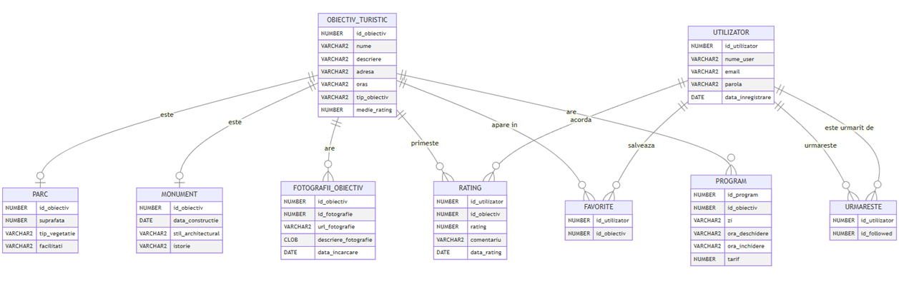
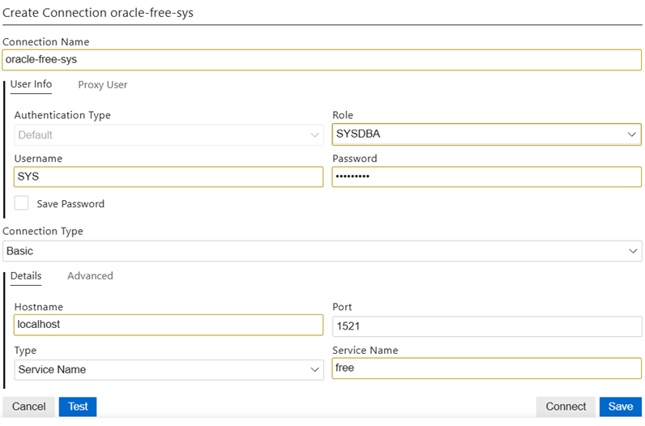
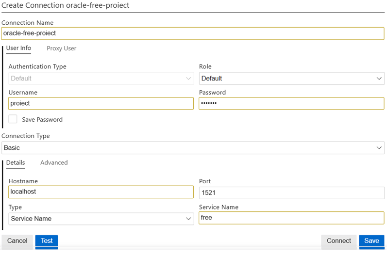
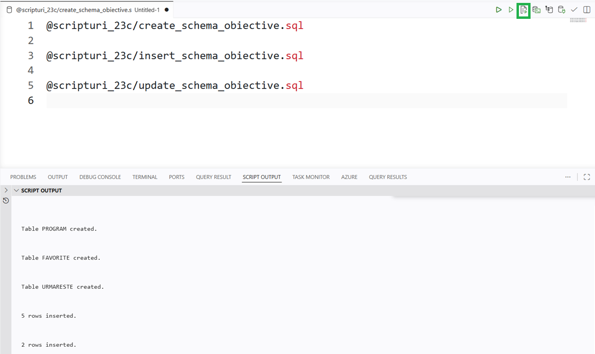

# Implementarea diagramei conceptuale

## Schema bazei de date

Baza de date conține 9 tabele organizate în jurul entității centrale `OBIECTIV_TURISTIC`.

| Tabel | Cheie primară | Descriere |
|-------|--------------|----------|
| OBIECTIV_TURISTIC | id_obiectiv | Entitate centrală; conține date generale despre obiectiv |
| PARC | id_obiectiv (FK) | Subtip de obiectiv — parc |
| MONUMENT | id_obiectiv (FK) | Subtip de obiectiv — monument |
| FOTOGRAFII_OBIECTIV | (id_obiectiv, id_fotografie) | Fotografii asociate unui obiectiv |
| UTILIZATOR | id_utilizator | Conturi de utilizator |
| RATING | (id_utilizator, id_obiectiv)` | Ratinguri și comentarii |
| FAVORITE | (id_utilizator, id_obiectiv) | Obiective marcate ca favorite |
| PROGRAM | (id_obiectiv, id_program)` | Program de vizitare și tarif |
| URMARESTE | (id_utilizator, id_followed) | Relații de urmărire între utilizatori |



---

## Setup bază de date 
## Pasul 1: Serverul

Asigurați-vă că aveți o instanță **Oracle Database Server** disponibilă cu una dintre variantele următoare.

### Opțiunea 1: Local

Descărcați varianta disponibilă în funcție de SO.

Download [Oracle Database Server -- Database Home](https://www.oracle.com/database/technologies/oracle21c-windows-downloads.html)

Urmați instrucțiunile pentru [instalare](https://docs.oracle.com/en/database/oracle/oracle-database/21/xeinw/index.html).

### Opțiunea 2: Container Docker

Mai multe detalii despre instalare Docker Desktop găsiți în fișierul Oracle_Docker.pdf 
Puteți utiliza imaginile disponibile la:

[Oracle 21c](https://hub.docker.com/r/gvenzl/oracle-free)

[Oracle 23c](https://hub.docker.com/r/gvenzl/oracle-xe)


Comenzile pentru a porni containerul în Docker sunt:

**Varianta 21c**
```
docker run -d --name oracle-db -p 1521:1521 -e ORACLE_PASSWORD=parola123 gvenzl/oracle-xe 
```


**Varianta 23c**

Se crează un containe cu numele oracle-free. User SYS va avea parola parola123. Și se va putea conecta la baza de date având host=localhost și SID=free.

```
docker run -d --name oracle-free -p 1521:1521 -e ORACLE_PASSWORD=parola123 gvenzl/oracle-free
```

> **Atenție:** Cele două containere nu pot rula simultan pe același port `1521`. Dacă doriți să le rulați în paralel, schimbați portul gazdă al unuia (ex. `-p 1522:1521`) și actualizați corespunzător parametrul **Port** în clientul SQL, precum și intrarea din `tnsnames.ora` din interiorul containerului.

### Opțiunea 3: Oracle Cloud Infrastructure

Creați o instanță [Autonomous Database](https://www.oracle.com/autonomous-database/) utilizând [OCI](https://www.oracle.com/cloud/).

## Pasul 2: Configurare utilizator

### 2.1 Conectare cu SYS

Conectați-vă ca utilizator **SYS** cu rolul **SYSDBA** la serverul pornit la pasul 1, folosind un client SQL (ex. Oracle SQL Developer sau extensia SQL Developer pentru VS Code, DBeaver, SQLcl).

Parametrii de conexiune în funcție de varianta aleasă:

| Parametru    | Oracle 23c (`oracle-free`) | Oracle 21c (`oracle-db`) |
|--------------|---------------------------|--------------------------|
| Host         | localhost                 | localhost                |
| Port         | 1521                      | 1521                     |
| Service Name | free                      | XE                       |
| Username     | SYS                       | SYS                      |
| Parolă       | parola123                 | parola123                |
| Role         | SYSDBA                    | SYSDBA                   |



### 2.2 Crearea utilizatorului de proiect

După conectarea cu SYS, rulați scriptul [create_user_proiect.sql](create_user_proiect.sql) sau executați manual comenzile de mai jos:

```sql
CREATE USER proiect IDENTIFIED BY proiect;

-- Acordă toate privilegiile (recomandat doar în mediu de dezvoltare)
GRANT DBA TO proiect;

-- Spațiu nelimitat pe tablespace-ul implicit
ALTER USER proiect QUOTA UNLIMITED ON users;
```

> Alternativ, dacă nu doriți rolul DBA, acordați privilegii minime:
> ```sql
> GRANT CREATE SESSION, CREATE TABLE, CREATE SEQUENCE,
>       CREATE VIEW, CREATE PROCEDURE, CREATE TRIGGER TO proiect;
> ALTER USER proiect QUOTA UNLIMITED ON users;
> ```

### 2.3 Conectare cu utilizatorul proiect

Creați o conexiune separată cu noul utilizator pentru a rula scripturile aplicației:

| Parametru    | Oracle 23c (`oracle-free`) | Oracle 21c (`oracle-db`) |
|--------------|---------------------------|--------------------------|
| Host         | localhost                 | localhost                |
| Port         | 1521                      | 1521                     |
| Service Name | free                      | XE                       |
| Username     | proiect                   | proiect                  |
| Parolă       | proiect                   | proiect                  |
| Role         | Default                   | Default                  |



---

## Pasul 3: Rularea scripturilor

Conectați-vă cu utilizatorul **proiect** și rulați scripturile în ordinea de mai jos. Folosiți directorul corespunzător versiunii serverului vostru.

| Ord. | Fișier | Utilizator | Descriere |
|------|--------|-----------|-----------|
| 1 | [create_user_proiect.sql](create_user_proiect.sql) | SYS (SYSDBA) | Creează utilizatorul `proiect` |
| 2 | `scripturi_21c/` sau `scripturi_23c/` → `create_schema_obiective.sql` | proiect | Creează tabelele și secvența |
| 3 | `scripturi_21c/` sau `scripturi_23c/` → `insert_schema_obiective.sql` | proiect | Inserează date de test |
| 4 | `scripturi_21c/` sau `scripturi_23c/` → `update_schema_obiective.sql` | proiect | Actualizează date (DML avansat) |
| 5 | `scripturi_21c/` sau `scripturi_23c/` → `exemple_interogari_schema_obiective.sql` | proiect | Interogări demonstrative |

> **Atenție la versiune:** `scripturi_23c/insert_schema_obiective.sql` folosește sintaxa multi-VALUES (`INSERT INTO ... VALUES (...),(...)`) introdusă în Oracle 23c. Pe Oracle 21c folosiți fișierele din `scripturi_21c/`.

> **Valori booleene:** Coloana `vizitabil` din `OBIECTIV_TURISTIC` este de tip `BOOLEAN` (valori `TRUE`/`FALSE`) în Oracle 23c. În Oracle 21c, același câmp este `NUMBER(1)` cu o constrângere `CHECK (vizitabil IN (0, 1))` care simulează același comportament cu valorile `1` (true) și `0` (false).

### Rularea scripturilor individual

Deschideți un nou SQL Worksheet (Ctrl + Shift + W) și rulați scripturile.

Pentru a rula fiecare script în parte:

```sql
-- Crearea tabelelor
@scripturi_21c/create_schema_obiective.sql
-- sau
@scripturi_23c/create_schema_obiective.sql
```

```sql
-- Inserarea datelor de test
@scripturi_21c/insert_schema_obiective.sql
-- sau
@scripturi_23c/insert_schema_obiective.sql
```

```sql
-- Actualizarea datelor
@scripturi_21c/update_schema_obiective.sql
-- sau
@scripturi_23c/update_schema_obiective.sql
```




### Resetarea schemei

Pentru a șterge toate tabelele și a relua de la zero:

```sql
-- Rulat ca utilizator proiect
@scripturi_21c/drop_schema_obiective.sql
-- sau
@scripturi_23c/drop_schema_obiective.sql
```