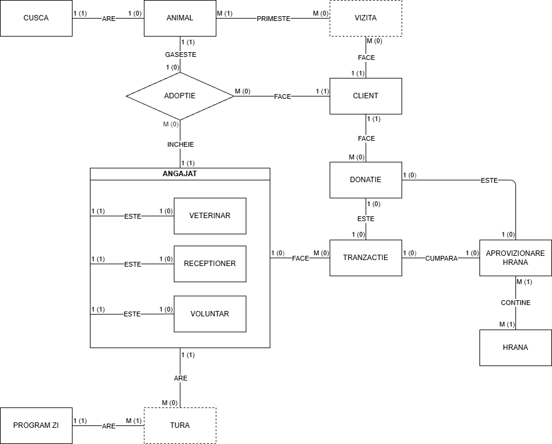
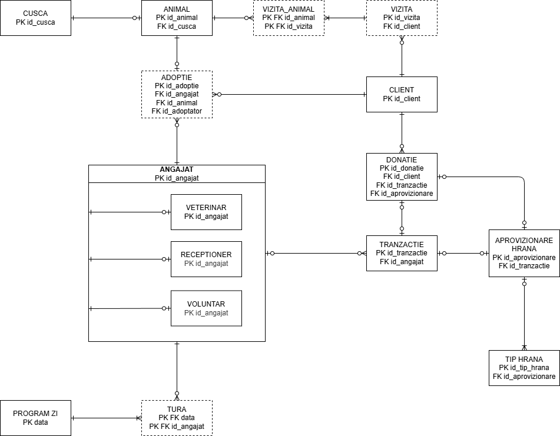

# Platformă de adopții de animale

O platformă online ce simplifică procesul de adopție al animăluțelor fără stăpân, astfel încât fiecare suflet să primească iubirea și dragostea pe care le merită.

---

## 1. Descrierea modelului real, a utilității acestuia și a regulilor de funcționare

Adăpostul va avea 3 tipuri de angajați: _veterinar_, _recepționer_,
 și _voluntar_, fiecare cu atribuții diferite. _Veterinarul_ se ocupă
  de îngrijirea medicală a animăluțelor, _recepționerul_ de primirea 
  oamenilor, înregistrarea în sistemul electronic a animăluțelor, 
  vizitelor, etc, iar _voluntarii_ se ocupă de tot ce ține de 
  îngrijirea animalelor - de la spălat, hrănit, scos la plimbare, la
   organizarea vizitelor și încurajarea adopțiilor.

Angajații vor avea mai multe _ture_, care vor fi organizate într-un
 _program zilnic_. În fiecare zi pot exista mai multe ture (ale mai 
 multor _angajați_), dar trebuie să existe cel puțin una (altfel nu 
 există motive să fie înregistrată acea zi).

Fiecare animăluț va avea propria _cușcă_ corespunzătoare - _cuștile_ 
sunt caracterizate de spațiul lor interior, și sunt ocupate de 
principiu în ordine descrescătoare a mărimii pentru confortul și 
nevoile animalelor. Bineînțeles, o cușcă poate rămâne goală.

Un om care dorește să viziteze adăpostul și să adopte un animal se va 
numi _client_. Acesta poate face mai multe _vizite_ pentru a 
cunoaște animăluțele adăpostului, iar, în momentul în care ia decizia 
să _adopte_ un animal, va putea să facă asta cu ajutorul unui 
_angajat_.

Totodată un _client_ poate să facă o _donație_ care să reprezinte o valoare monetară înregistrată în _tranzacții_, sau mâncare pentru animăluțe înregistrată în _aprovizionare hrană_.

Pentru cumpărarea de hrană, fiecare aprovizionare va fi înregistrată de un _angajat_ în tabelul de _tranzacții_, dinpreună cu _aprovizionarea_ și _tipurile de hrană_. 

## 2. Prezentarea constrângerilor impuse asupra modelului
- Orice _cușcă_ trebuie să aibă mai mult de 1 metru pătrat
- Orice _animal_ trebuie să aibă propria _cușcă_
- O adopție trebuie să aibă exact un _animal_, un _client_, și un _angajat_ care să proceseze informațiile
- O _vizită_ trebuie să aibă exact un _client_
- O _donație_ trebuie să aibă exact un _client_
- O _donație_ este fie o _tranzacție_, fie o _aprovizionare cu hrană_
- O _aprovizionare de hrană_ trebuie să aibă măcar un _tip de hrană_
- _Programul unei zile_ trebuie să aibă măcar o _tură_, iar fiecare _tură_ trebuie să fie repartizată într-o anumită zi
- O _tranzacție_ mai mare de 500 de lei va necesita prezența unui _angajat_ pentru a fi procesată
- Un _voluntar_ nu poate procesa _tranzacții_
- Unui _client_ trebuie să i se știe fie numărul de telefon fie adresa de e-mail.

## 3. Descrierea entităților

### Cușcă
**Cheie primară:** id_cușcă
- Înregistrarea cuștilor aferente spațiului în care sunt ținute animalele, cu detalii relevante
### Animal
**Cheie primară:** id_animal
- Înregistrarea animalelor din adăpost, dinpreună cu rasa, nume sau alte detalii relevante
### Vizită
**Cheie primară:** id_vizită
- Atunci când un client este interesat să adopte animale, acesta poate să programeze o vizită
pentru a cunoaște animăluțele și a interacționa cu ele
### Client
**Cheie primară:** id_client
- Orice potențial adoptator, oameni care doresc să facă vizite adăpostului sau donatori sunt
considerați clienți și înregistrați în sistem
### Adopție
**Cheie primară:** id_adopție
- Momentul fericit al unei adopții este înregistrat prin acest tabel de aritate 3 dinpreună
cu informațiile clientului, al animăluțului adoptat și al angajatului care a procesat adopția
### Angajat
**Cheie primară:** id_angajat
- Toți angajații firmei sunt înregistrați în acest tabel, cu informațiile aferente poziției pe 
care o au: veterinar, recepționer sau voluntar
### Donație
**Cheie primară:** id_donație
- Donațiile care se fac pentru adăpost sunt înregistrate în acest tabel, fie că aceste sunt
monetare sau de hrană
### Tranzacție
**Cheie primară:** id_tranzacție
- Orice tip de venit sau cheltuială este înregistrată în acest tabel, pentru a putea ține evidența
financiară
### Aprovizionare hrană
**Cheie primară:** id_aprovizionare
- Aprovizionările cu hrană, fie că acestea sunt cumpărate din veniturile clinicii sau donații sunt înregistrate aici
### Tip hrană
**Cheie primară:** id_tip_hrana
- Fiecare aprovizionare cu hrană conține unul sau mai multe tipuri de hrană (de căței, de pisici,
pentru juniori, pentru adulți etc)
### Tura
**Cheie primară:** data, id_angajat
- Programul pe o zi este împărțit în ture, astfel că un angajat este repartizat pe fiecare tură
### Program zi
**Cheie primară:** data
- Colecție de ture care constituie un program zilnic

## 4. Descrierea relațiilor
### Cușcă - Animal
- one-to-one
### Animal - Vizită
- many-to-many
### Client - Vizită
- one-to-many
### Adopție: Animal - Client - Angajat
- one-to-many-to-many
- relație de aritate 3
### Client - Donație
- one-to-many
### Donație - Tranzacție
- one-to-one
### Donație - Aprovizionare Hrană
- one-to-one
### Aprovizionare Hrană - Tip Hrană
- one-to-many
### Angajat - Tranzacție
- one-to-many
### Angajat - Tură
- one-to-many
### Tură - Program Zi
- many-to-one

## 5. Descrierea atributelor
atribut 
tip de date 
constrângeri 
valori posibile/exemple
valori implicite
observatii

### Cușcă
| Atribut | Tip de Date | Constrângeri | Valori Posibile/Exemple | Valori Implicite | Observatii
|----|--------|---|---|---|---|
|id_cusca|NUMBER(13)|PK||||
|capacitate|NUMBER(2,2)|NOT NULL, capacitate > 1|||Spațiul disponibil în cușcă în metri pătrați|
|locatie|ENUM, VARCHAR2||interior, exterior|interior||

### Animal
| Atribut | Tip de Date | Constrângeri | Valori Posibile/Exemple | Valori Implicite | Observatii
|----|--------|---|---|---|---|
|id_animal|NUMBER(13)|PK||||
|id_cusca|NUMBER(13)|FK, NOT NULL||||
|nume|VARCHAR2||||Numele animăluțului (dacă există)|
|specie|VARCHAR2|NOT NULL|câine, pisică, papagal, etc.|||
|rasa|VARCHAR2||terrier, sfinx, etc.|||
|in_tratament|NUMBER(1)|in_tratament IN (0, 1)|||Este animalul în tratament la clinică sau nu|
|data_aducere|DATE|NOT NULL|||Când a fost animalul adus în adăpost|

### Vizită Animal
| Atribut | Tip de Date | Constrângeri | Valori Posibile/Exemple | Valori Implicite | Observatii
|----|--------|---|---|---|---|
|id_animal|NUMBER(13)|PK FK||||
|id_vizită|NUMBER(13)|PK FK||||

### Vizită
| Atribut | Tip de Date | Constrângeri | Valori Posibile/Exemple | Valori Implicite | Observatii
|----|--------|---|---|---|---|
|id_vizită|NUMBER(13)|PK||||
|id_client|NUMBER(13)|FK, NOT NULL||||
|data_ora|DATETIME|NOT NULL||||
|detalii|VARCHAR2||potential adoptator, client donator, interesat să ia un cățel, etc.||Alte detalii relevante vizitei|

### Client
| Atribut | Tip de Date | Constrângeri | Valori Posibile/Exemple | Valori Implicite | Observatii
|----|--------|---|---|---|---|
|id_client|NUMBER(13)|PK||||
|nume|VARCHAR2|NOT NULL||||
|prenume|VARCHAR2|NOT NULL||||
|telefon|VARCHAR2|telefon IS NOT NULL OR email IS NOT NULL||||
|email|VARCHAR2|telefon IS NOT NULL OR email IS NOT NULL||||

### Adopție
| Atribut | Tip de Date | Constrângeri | Valori Posibile/Exemple | Valori Implicite | Observatii
|----|--------|---|---|---|---|
|id_adopție|NUMBER(13)|PK||||
|id_angajat|NUMBER(13)|FK, NOT NULL||||
|id_animal|NUMBER(13)|FK, NOT NULL||||
|id_adoptator|NUMBER(13)|FK, NOT NULL||||
|data|DATE|||||

### Angajat
| Atribut | Tip de Date | Constrângeri | Valori Posibile/Exemple | Valori Implicite | Observatii
|----|--------|---|---|---|---|
|id_angajat|NUMBER(13)|PK||||
|nume|VARCHAR2|NOT NULL||||
|prenume|VARCHAR2|NOT NULL||||
|telefon|VARCHAR2|NOT NULL||||
|email|VARCHAR2|NOT NULL||||
|data_angajare|DATE|NOT NULL||||
|pozitie|ENUM, VARCHAR2|NOT NULL|veterinar, receptioner, voluntar|||

### Donație
| Atribut | Tip de Date | Constrângeri | Valori Posibile/Exemple | Valori Implicite | Observatii
|----|--------|---|---|---|---|
|id_donatie|NUMBER(13)|PK||||
|id_client|NUMBER(13)|FK, NOT NULL||||
|id_tranzactie|NUMBER(13)|FK||||
|id_aprovizionare|NUMBER(13)|FK||||

### Tranzacție
| Atribut | Tip de Date | Constrângeri | Valori Posibile/Exemple | Valori Implicite | Observatii
|----|--------|---|---|---|---|
|id_tranzactie|NUMBER(13)|PK||||
|id_angajat|NUMBER(13)|FK, suma <= 500 OR id_angajat IS NOT NULL||||
|suma|NUMBER(10,2)|NOT NULL, suma <= 500 OR id_angajat IS NOT NULL||||
|data_ora|DATETIME|NOT NULL||||
|detalii|VARCHAR2||donatie, mancare, etc.|||

### Aprovizionare hrană
| Atribut | Tip de Date | Constrângeri | Valori Posibile/Exemple | Valori Implicite | Observatii
|----|--------|---|---|---|---|
|id_aprovizionare|NUMBER(13)|PK||||
|id_tranzactie|NUMBER(13)|FK||||
|data_ora|DATETIME|NOT NULL||||
|furnizor|VARCHAR2||royal canin, marin popescu, etc.||De unde a fost cumpărată mâncarea|

### Tip hrană
| Atribut | Tip de Date | Constrângeri | Valori Posibile/Exemple | Valori Implicite | Observatii
|----|--------|---|---|---|---|
|id_tip_hrana|NUMBER(13)|PK||||
|id_aprovizionare|NUMBER(13)|FK, NOT NULL||||
|tip_mancare|VARCHAR2|NOT NULL|mâncare uscată căței, mâncare umedă pisici, semințe, etc.|||
|firma|VARCHAR2|NOT NULL|royal canin, whiskas, etc.|||
|denumire|VARCHAR2|||||
|detalii|VARCHAR2||mancare regim, etc.|||
|cantitate|NUMBER(10,3)|NOT NULL|||Cantitatea fară a se preciza unitatea de măsură|
|um|VARCHAR2|NOT NULL|kg, g, unitati, etc.|g||

### Tura
| Atribut | Tip de Date | Constrângeri | Valori Posibile/Exemple | Valori Implicite | Observatii
|----|--------|---|---|---|---|
|data|NUMBER(13)|PK FK||||
|id_angajat|NUMBER(13)|PK FK||||
|detalii|VARCHAR2||tura de inchidere, tura aglomerata, etc.|||

### Program zi
| Atribut | Tip de Date | Constrângeri | Valori Posibile/Exemple | Valori Implicite | Observatii
|----|--------|---|---|---|---|
|data|NUMBER(13)|PK||||
|tip_zi|VARCHAR2|NOT NULL|normala, eveniment, inventar, dezinsectie, deratizare, etc.|||

## 6. Diagrama entitate-relație

## 7. Diagrama conceptuală

## 8. Enumerarea schemelor relaționale
**CUSCA**(#id_cusca, capacitate, locatie)

**ANIMAL**(#id_animal, id_cusca, nume, specie, rasa, in_tratament, data_aducere)

**VIZITA_ANIMAL**(#id_animal, #id_vizita)

**VIZITA**(#id_vizita, id_client, data_ora, detalii)

**CLIENT**(#id_client, nume, prenume, telefon, email)

**ADOPTIE**(#id_adoptie, id_angajat, id_animal, id_adoptator, data)

**ANGAJAT**(#id_angajat, nume, prenume, telefon, email, data_angajare, pozitie)

**DONATIE**(#id_donatie, id_client, id_tranzactie, id_aprovizionare)

**TRANZACTIE**(#id_tranzactie, id_angajat, suma, data_ora, detalii)

**APROVIZIONARE_HRANA**(#id_aprovizionare, id_tranzactie, data_ora, furnizor)

**TIP_HRANA**(#id_tip_hrana, id_aprovizionare, tip_mancare, firma, denumire, detalii, cantitate, um)

**TURA**(#data, #id_angajat, detalii)

**PROGRAM_ZI**(#data, tip_zi)

## 9. Realizarea normalizării până la forma normală 3 - contraexemple

### FN1

- **Contraexemplu**

**ANGAJAT**
|#id_angajat|nume|prenume|contact|data_angajare|pozitie|
|-----------|----|-------|-------|-------------|-------|
|       1234|dinu|  maria|0712345678, maria.dinu@gmail.com|2025-07-01|receptioner|
***

- **Soluție**

**ANGAJAT**
|#id_angajat|nume|prenume|telefon|email|data_angajare|pozitie|
|-----------|----|-------|-------|-----|-------------|-------|
|       1234|dinu|  maria|0712345678|maria.dinu@gmail.com|2025-07-01|receptioner|
***
**Argument**

Coloana _contact_ nu este atomizată, putând să aibă mai multe valori. Se aduce la FN1 prin împărțirea valorilor posibile în coloane diferite.

### FN2

- **Contraexemplu**

**VIZITA_ANIMAL**
|#id_animal|#id_vizita|nume_animal|
|----------|----------|-----------|
|       123|       456|       spot|

***
- **Soluție**

**VIZITA_ANIMAL**
|#id_animal|#id_vizita|
|----------|----------|
|       123|       456|

**ANIMAL**
|#id_animal|nume|
|----------|----|
|       123|spot|

***
- **Argument**

Coloana _nume_ depinde doar de atributul *#id_animal* din cheia primară, nu de întreaga cheie. Așadar, se elimină coloana și se adaugă în tabelul cu informațiile despre animale.

### FN3
- **Contraexemplu**

**TRANZACTIE**
|#id_tranzactie|id_angajat|nume_angajat|suma|data_ora|detalii|
|--------------|----------|------------|----|--------|-------|
|123|456|petrescu|789.02| 2026-02-15 13:29:53||

***
- **Soluție**

**TRANZACTIE**
|#id_tranzactie|id_angajat|suma|data_ora|detalii|
|--------------|----------|----|--------|-------|
|123|456|789.02| 2026-02-15 13:29:53||

**ANGAJAT**
|id_angajat|nume_angajat|
|-|-|
|456|petrescu|

***
- **Argument**

Coloana *nume_angajat* este dependentă de coloana non-cheie primară *id_angajat*. Pentru a aduce tabelele la forma normală 3, se mută coloana *nume_angajat* în tabelul aferent informațiilor cu angajații.
