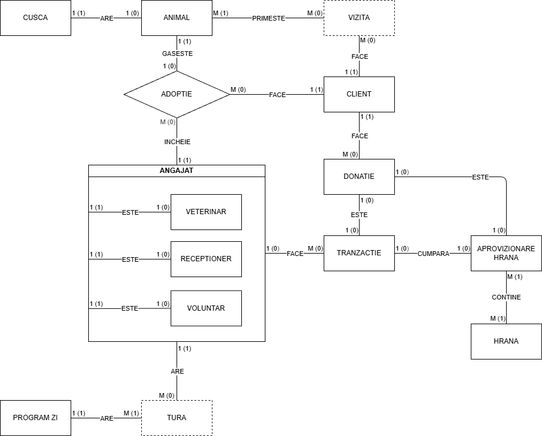
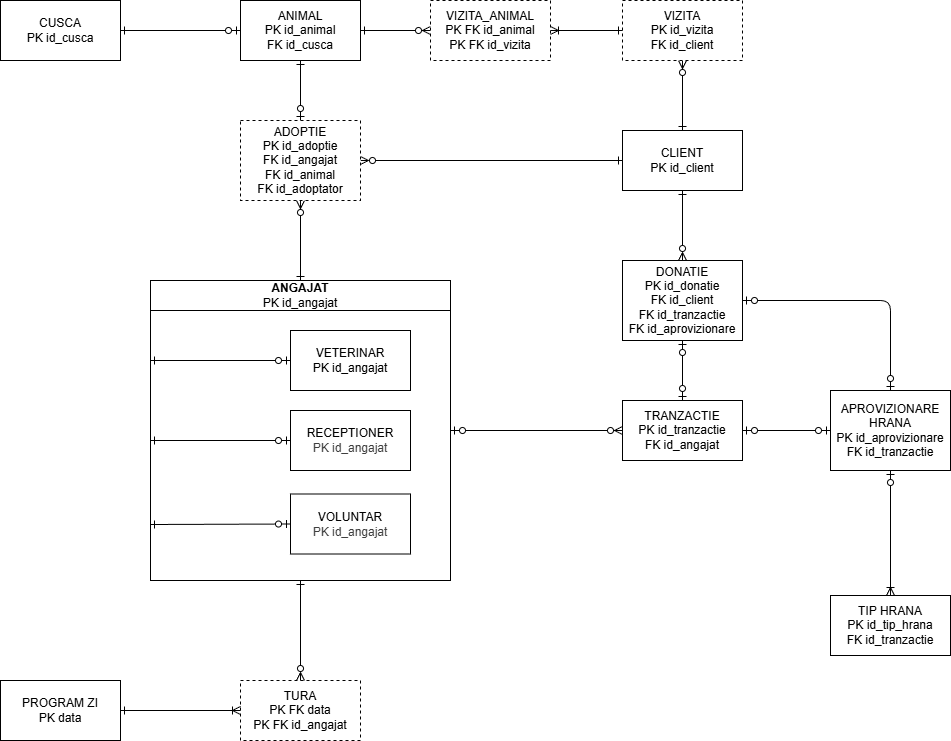

# Platformă de adopții de animale

O platformă online ce simplifică procesul de adopție al animăluțelor fără stăpân, astfel încât fiecare suflet să primească iubirea și dragostea pe care le merită.

---

## 1. Descrierea modelului real, a utilității acestuia și a regulilor de funcționare

Adăpostul va avea 3 tipuri de angajați: _veterinar_, _recepționer_,
 și _voluntar_, fiecare cu atribuții diferite. _Veterinarul_ se ocupă
  de îngrijirea medicală a animăluțelor, _recepționerul_ de primirea 
  oamenilor, înregistrarea în sistemul electronic a animăluțelor, 
  vizitelor, etc, iar _voluntarii_ se ocupă de tot ce ține de 
  îngrijirea animalelor - de la spălat, hrănit, scos la plimbare, la
   organizarea vizitelor și încurajarea adopțiilor.

Angajații vor avea mai multe _ture_, care vor fi organizate într-un
 _program zilnic_. În fiecare zi pot exista mai multe ture (ale mai 
 multor _angajați_), dar trebuie să existe cel puțin una (altfel nu 
 există motive să fie înregistrată acea zi).

Fiecare animăluț va avea propria _cușcă_ corespunzătoare - _cuștile_ 
sunt caracterizate de spațiul lor interior, și sunt ocupate de 
principiu în ordine descrescătoare a mărimii pentru confortul și 
nevoile animalelor. Bineînțeles, o cușcă poate rămâne goală.

Un om care dorește să viziteze adăpostul și să adopte un animal se va 
numi _client_. Acesta poate face mai multe _vizite_ pentru a 
cunoaște animăluțele adăpostului, iar, în momentul în care ia decizia 
să _adopte_ un animal, va putea să facă asta cu ajutorul unui 
_angajat_.

Totodată un _client_ poate să facă o _donație_ care să reprezinte o valoare monetară înregistrată în _tranzacții_, sau mâncare pentru animăluțe înregistrată în _aprovizionare hrană_.

Pentru cumpărarea de hrană, fiecare aprovizionare va fi înregistrată de un _angajat_ în tabelul de _tranzacții_, dinpreună cu _aprovizionarea_ și _tipurile de hrană_. 


## 2. Prezentarea constrângerilor impuse asupra modelului
- Orice _cușcă_ trebuie să aibă mai mult de 1 metru pătrat
- Orice _animal_ trebuie să aibă propria _cușcă_
- O adopție trebuie să aibă exact un _animal_, un _client_, și un _angajat_ care să proceseze informațiile
- O _vizită_ trebuie să aibă exact un _client_
- O _donație_ trebuie să aibă exact un _client_
- O _donație_ este fie o _tranzacție_, fie o _aprovizionare cu hrană_
- O _aprovizionare de hrană_ trebuie să aibă măcar un _tip de hrană_
- _Programul unei zile_ trebuie să aibă măcar o _tură_, iar fiecare _tură_ trebuie să fie repartizată într-o anumită zi
- O _tranzacție_ mai mare de 500 de lei va necesita prezența unui _angajat_ pentru a fi procesată
- Un _voluntar_ nu poate procesa _tranzacții_
- Unui _client_ trebuie să i se știe fie numărul de telefon fie adresa de e-mail.

## 3. Descrierea entităților

### Cușcă
**Cheie primară:** id_cușcă
- Înregistrarea cuștilor aferente spațiului în care sunt ținute animalele, cu detalii relevante
### Animal
**Cheie primară:** id_animal
- Înregistrarea animalelor din adăpost, dinpreună cu rasa, nume sau alte detalii relevante
### Vizită
**Cheie primară:** id_vizită
- Atunci când un client este interesat să adopte animale, acesta poate să programeze o vizită
pentru a cunoaște animăluțele și a interacționa cu ele
### Client
**Cheie primară:** id_client
- Orice potențial adoptator, oameni care doresc să facă vizite adăpostului sau donatori sunt
considerați clienți și înregistrați în sistem
### Adopție
**Cheie primară:** id_adopție
- Momentul fericit al unei adopții este înregistrat prin acest tabel de aritate 3 dinpreună
cu informațiile clientului, al animăluțului adoptat și al angajatului care a procesat adopția
### Angajat
**Cheie primară:** id_angajat
- Toți angajații firmei sunt înregistrați în acest tabel, cu informațiile aferente poziției pe 
care o au: veterinar, recepționer sau voluntar
### Donație
**Cheie primară:** id_donație
- Donațiile care se fac pentru adăpost sunt înregistrate în acest tabel, fie că aceste sunt
monetare sau de hrană
### Tranzacție
**Cheie primară:** id_tranzacție
- Orice tip de venit sau cheltuială este înregistrată în acest tabel, pentru a putea ține evidența
financiară
### Aprovizionare hrană
**Cheie primară:** id_aprovizionare
- Aprovizionările cu hrană, fie că acestea sunt cumpărate din veniturile clinicii sau donații sunt înregistrate aici
### Hrană
**Cheie primară:** id_hrana
- Fiecare aprovizionare cu hrană conține unul sau mai multe tipuri de hrană (de căței, de pisici,
pentru juniori, pentru adulți etc)
### Tura
**Cheie primară:** data, id_angajat
- Programul pe o zi este împărțit în ture, astfel că un angajat este repartizat pe fiecare tură
### Program zi
**Cheie primară:** data
- Colecție de ture care constituie un program zilnic

## 4. Descrierea relațiilor
### Cușcă - Animal
- one-to-one
### Animal - Vizită
- many-to-many
### Client - Vizită
- one-to-many
### Adopție: Animal - Client - Angajat
- one-to-many-to-many
- relație de aritate 3
### Client - Donație
- one-to-many
### Donație - Tranzacție
- one-to-one
### Donație - Aprovizionare Hrană
- one-to-one
### Aprovizionare Hrană - Hrană
- many-to-many
### Angajat - Tranzacție
- one-to-many
### Angajat - Tură
- one-to-many
### Tură - Program Zi
- many-to-one

## 5. Descrierea atributelor

### Cușcă
| Atribut | Tip de Date | Constrângeri | Valori Posibile/Exemple | Valori Implicite | Observatii
|----|--------|---|---|---|---|
|id_cusca|NUMBER(13)|PK||||
|capacitate|NUMBER(2,2)|NOT NULL, capacitate > 1|||Spațiul disponibil în cușcă în metri pătrați|
|locatie|ENUM, VARCHAR2||interior, exterior|interior||


### Animal
| Atribut | Tip de Date | Constrângeri | Valori Posibile/Exemple | Valori Implicite | Observatii
|----|--------|---|---|---|---|
|id_animal|NUMBER(13)|PK||||
|id_cusca|NUMBER(13)|FK, NOT NULL||||
|nume|VARCHAR2||||Numele animăluțului (dacă există)|
|data_nastere|DATE|NOT NULL|||Data aproximativă de naștere a animalului|
|specie|VARCHAR2|NOT NULL|câine, pisică, papagal, etc.|||
|rasa|VARCHAR2||terrier, sfinx, etc.|||
|in_tratament|NUMBER(1)|in_tratament IN (0, 1)|||Este animalul în tratament la clinică sau nu|
|data_aducere|DATE|NOT NULL|||Când a fost animalul adus în adăpost|

### Vizită Animal
| Atribut | Tip de Date | Constrângeri | Valori Posibile/Exemple | Valori Implicite | Observatii
|----|--------|---|---|---|---|
|id_animal|NUMBER(13)|PK FK||||
|id_vizită|NUMBER(13)|PK FK||||

### Vizită
| Atribut | Tip de Date | Constrângeri | Valori Posibile/Exemple | Valori Implicite | Observatii
|----|--------|---|---|---|---|
|id_vizită|NUMBER(13)|PK||||
|id_client|NUMBER(13)|FK, NOT NULL||||
|data_ora|DATETIME|NOT NULL||||
|detalii|VARCHAR2||potential adoptator, client donator, interesat să ia un cățel, etc.||Alte detalii relevante vizitei|

### Client
| Atribut | Tip de Date | Constrângeri | Valori Posibile/Exemple | Valori Implicite | Observatii
|----|--------|---|---|---|---|
|id_client|NUMBER(13)|PK||||
|nume|VARCHAR2|NOT NULL||||
|prenume|VARCHAR2|NOT NULL||||
|telefon|VARCHAR2|telefon IS NOT NULL OR email IS NOT NULL||||
|email|VARCHAR2|telefon IS NOT NULL OR email IS NOT NULL||||

### Adopție
| Atribut | Tip de Date | Constrângeri | Valori Posibile/Exemple | Valori Implicite | Observatii
|----|--------|---|---|---|---|
|id_adopție|NUMBER(13)|PK||||
|id_angajat|NUMBER(13)|FK, NOT NULL||||
|id_animal|NUMBER(13)|FK, NOT NULL||||
|id_adoptator|NUMBER(13)|FK, NOT NULL||||
|data|DATE|||||

### Angajat
| Atribut | Tip de Date | Constrângeri | Valori Posibile/Exemple | Valori Implicite | Observatii |
|----|--------|---|---|---|---|
|id_angajat|NUMBER(13)|PK||||
|nume|VARCHAR2|NOT NULL||||
|prenume|VARCHAR2|NOT NULL||||
|telefon|VARCHAR2|NOT NULL||||
|email|VARCHAR2|NOT NULL||||
|data_angajare|DATE|NOT NULL||SYSDATE||

### Veterinar
| Atribut | Tip de Date | Constrângeri | Valori Posibile/Exemple | Valori Implicite | Observatii |
|----|--------|---|---|---|---|
|id_angajat|NUMBER(13)|PK FK||||
|specializare|VARCHAR2||pasari, animale mari, etc.|general||


### Recepționer
| Atribut | Tip de Date | Constrângeri | Valori Posibile/Exemple | Valori Implicite | Observatii |
|----|--------|---|---|---|---|
|id_angajat|NUMBER(13)|PK FK||||
|tura_preferata|VARCHAR2||dimineata, seara, oricare, etc.|||

### Voluntar
| Atribut | Tip de Date | Constrângeri | Valori Posibile/Exemple | Valori Implicite | Observatii |
|----|--------|---|---|---|---|
|id_angajat|NUMBER(13)|PK FK||||
|ocupatie|VARCHAR2||elev, suudent, angajat, etc.|||

### Donație
| Atribut | Tip de Date | Constrângeri | Valori Posibile/Exemple | Valori Implicite | Observatii
|----|--------|---|---|---|---|
|id_donatie|NUMBER(13)|PK||||
|id_client|NUMBER(13)|FK, NOT NULL||||
|id_tranzactie|NUMBER(13)|FK||||
|id_aprovizionare|NUMBER(13)|FK||||

### Tranzacție
| Atribut | Tip de Date | Constrângeri | Valori Posibile/Exemple | Valori Implicite | Observatii
|----|--------|---|---|---|---|
|id_tranzactie|NUMBER(13)|PK||||
|id_angajat|NUMBER(13)|FK, suma <= 500 OR id_angajat IS NOT NULL||||
|suma|NUMBER(10,2)|NOT NULL, suma <= 500 OR id_angajat IS NOT NULL||||
|data_ora|DATETIME|NOT NULL||||
|detalii|VARCHAR2||donatie, mancare, etc.|||

### Aprovizionare hrană
| Atribut | Tip de Date | Constrângeri | Valori Posibile/Exemple | Valori Implicite | Observatii
|----|--------|---|---|---|---|
|id_aprovizionare|NUMBER(13)|PK||||
|id_tranzactie|NUMBER(13)|FK||||
|data_ora|DATETIME|NOT NULL||||
|furnizor|VARCHAR2||royal canin, marin popescu, etc.||De unde a fost cumpărată mâncarea|

### Comandă Hrană
| Atribut | Tip de Date | Constrângeri | Valori Posibile/Exemple | Valori Implicite | Observatii |
|----|--------|---|---|---|---|
|id_hrana|NUMBER(13)|PK FK||||
|id_aprovizionare|NUMBER(13)|PK FK||||
|cantitate|NUMBER(10,3)|NOT NULL|||Cantitatea fară a se preciza unitatea de măsură|
|um|VARCHAR2|NOT NULL|kg, g, unitati, etc.|g||

### Hrană
| Atribut | Tip de Date | Constrângeri | Valori Posibile/Exemple | Valori Implicite | Observatii
|----|--------|---|---|---|---|
|id_hrana|NUMBER(13)|PK||||
|tip_mancare|VARCHAR2|NOT NULL|mâncare uscată căței, mâncare umedă pisici, semințe, etc.|||
|firma|VARCHAR2|NOT NULL|royal canin, whiskas, etc.|||
|denumire|VARCHAR2|||||
|detalii|VARCHAR2||mancare regim, etc.|||


### Tura
| Atribut | Tip de Date | Constrângeri | Valori Posibile/Exemple | Valori Implicite | Observatii
|----|--------|---|---|---|---|
|data_ora|DATETIME|PK FK||||
|id_angajat|NUMBER(13)|PK FK||||
|durata|NUMBER(4,2)||||Durata în ore a turei|
|detalii|VARCHAR2||tura de inchidere, tura aglomerata, etc.|||

### Program zi
| Atribut | Tip de Date | Constrângeri | Valori Posibile/Exemple | Valori Implicite | Observatii
|----|--------|---|---|---|---|
|data|NUMBER(13)|PK||||
|tip_zi|VARCHAR2|NOT NULL|normala, eveniment, inventar, dezinsectie, deratizare, etc.|||


## 6. Diagrama entitate-relație


## 7. Diagrama conceptuală


## 8. Enumerarea schemelor relaționale
**CUSCA**(#id_cusca, capacitate, locatie)

**ANIMAL**(#id_animal, id_cusca, nume, data_nastere, specie, rasa, in_tratament, data_aducere)

**VIZITA_ANIMAL**(#id_animal, #id_vizita)

**VIZITA**(#id_vizita, id_client, data_ora, detalii)

**CLIENT**(#id_client, nume, prenume, telefon, email)

**ADOPTIE**(#id_adoptie, id_angajat, id_animal, id_adoptator, data)

**ANGAJAT**(#id_angajat, nume, prenume, telefon, email, data_angajare, pozitie)

**VETERINAR**(#id_angajat, specializare)

**RECEPTIONER**(#id_angajat, tura_preferata)

**VOLUNTAR**(#id_angajat, ocupatie)

**DONATIE**(#id_donatie, id_client, id_tranzactie, id_aprovizionare)

**TRANZACTIE**(#id_tranzactie, id_angajat, suma, data_ora, detalii)

**APROVIZIONARE_HRANA**(#id_aprovizionare, id_tranzactie, data_ora, furnizor)

**COMANDA_HRANA**(#id_aprovizionare, #id_hrana)

**HRANA**(#id_hrana, tip_mancare, firma, denumire, detalii, cantitate, um)

**TURA**(#data_ora, #id_angajat, detalii)

**PROGRAM_ZI**(#data, tip_zi)


## 9. Realizarea normalizării până la forma normală 3 - contraexemple

### FN1

- **Contraexemplu**

**ANGAJAT**
|#id_angajat|nume|prenume|contact|data_angajare|pozitie|
|-----------|----|-------|-------|-------------|-------|
|       1234|dinu|  maria|0712345678, maria.dinu@gmail.com|2025-07-01|receptioner|
***

- **Soluție**

**ANGAJAT**
|#id_angajat|nume|prenume|telefon|email|data_angajare|pozitie|
|-----------|----|-------|-------|-----|-------------|-------|
|       1234|dinu|  maria|0712345678|maria.dinu@gmail.com|2025-07-01|receptioner|
***
**Argument**

Coloana _contact_ nu este atomizată, putând să aibă mai multe valori. Se aduce la FN1 prin împărțirea valorilor posibile în coloane diferite.

### FN2

- **Contraexemplu**

**VIZITA_ANIMAL**
|#id_animal|#id_vizita|nume_animal|
|----------|----------|-----------|
|       123|       456|       spot|

***
- **Soluție**

**VIZITA_ANIMAL**
|#id_animal|#id_vizita|
|----------|----------|
|       123|       456|

**ANIMAL**
|#id_animal|nume|
|----------|----|
|       123|spot|

***
- **Argument**

Coloana _nume_ depinde doar de atributul *#id_animal* din cheia primară, nu de întreaga cheie. Așadar, se elimină coloana și se adaugă în tabelul cu informațiile despre animale.

### FN3
- **Contraexemplu**

**TRANZACTIE**
|#id_tranzactie|id_angajat|nume_angajat|suma|data_ora|detalii|
|--------------|----------|------------|----|--------|-------|
|123|456|petrescu|789.02| 2026-02-15 13:29:53||

***
- **Soluție**

**TRANZACTIE**
|#id_tranzactie|id_angajat|suma|data_ora|detalii|
|--------------|----------|----|--------|-------|
|123|456|789.02| 2026-02-15 13:29:53||

**ANGAJAT**
|id_angajat|nume_angajat|
|-|-|
|456|petrescu|

***
- **Argument**

Coloana *nume_angajat* este dependentă de coloana non-cheie primară *id_angajat*. Pentru a aduce tabelele la forma normală 3, se mută coloana *nume_angajat* în tabelul aferent informațiilor cu angajații.

## 16. Optimizarea unei cereri
Înainte de optimizare avem arborele
```
        π (nume, prenume)
               |
            DISTINCT
               |
             JOIN
            /    \
       client    vizita
               |
             IN
               |
            donatie
```
și expresia algebrică
$$
\pi_{nume,\, prenume}
\Big(
client \bowtie_{client.id\_client = vizita.id\_client} vizita
\Big)
\cap
\Big(
\pi_{nume,\, prenume}
\big(
client \bowtie \sigma_{id\_client \in donatie}(donatie)
\big)
\Big)
$$

**Probleme**
- subcererea corelata generează un cost mare
- join este făcut înainte de filtrare
- distinc necesar pentru eliminarea redundanței

Prin transformarea subcererii într-un join, optimizăm cererea, scăpăm de
valorile redundante și utilizăm strict valorile utile. Index-ul eficientizează 
căutarea valorilor prin pre-calcularea unui B-tree în detrimentul căutării rând
cu rând.

După optimizare avem arborele
```
          π (nume, prenume)
                    |
                  JOIN
                /      \
            JOIN       donatie
          /      \
     client     vizita
```

și expresia algebrică
$$
\pi_{nume,\, prenume}
\Big(
(client \bowtie_{client.id\_client = vizita.id\_client} vizita)
\bowtie_{client.id\_client = donatie.id\_client} donatie
\Big)
$$

## 17. Realizarea normalizării până la BCNF, FN4, FN5 - contraexemple
### BCNF
- **Contraexemplu**

**VIZITA_ANIMAL**

|id_animal|id_vizita|id_client|
|---------|---------|---------|
|5|2|7|
|5|3|2|
|7|2|7|
|4|1|7|

***
- **Soluție**

**VIZITA_ANIMAL**

|id_animal|id_vizita|
|---------|---------|
|5|2|
|5|3|
|7|2|
|4|1|

**VIZITA**
|id_vizita|id_client|
|---------|---------|
|2|7|
|3|2|
|1|7|

***
- **Argument**
Candidații pentru cheia primară în tabelul inițial *VIZITĂ_ANIMAL* sunt
*(id_animal, id_client)* sau *(id_animal, id_vizita)*. Astfel, atributul
*id_client* este prim și deci tabelul se află în FN3 chiar dacă *id_vizită*
determină *id_client*. Prin separarea celor 2 tabele, aducem la BCNF.

### FN4
- **Contraexemplu**

**VOLUNTAR**

|id_angajat|ocupatie|certificare|
|----------|--------|-----------|
|5|student|prim-ajutor|
|5|student|cosmetică|
|7|it|prim-ajutor|
|7|meditator|prim-ajutor|

***
- **Soluție**

**OCUPAȚIE_VOLUNTAR**

|id_angajat|ocupatie|
|----------|--------|
|5|student|
|7|it|
|7|meditator|

**CERTIFICARE_VOLUNTAR**

|id_angajat|certificare|
|----------|-----------|
|5|prim-ajutor|
|5|cosmetică|
|7|prim-ajutor|

***
- **Argument**
Atributele *ocupație* și *certificare* sunt total independente și pot avea mai
multe valori, astfel încât fiind în același tabel vor creea multe redundanțe și
sunt predispuse la a genera erori prin inserarea și actualizarea datelor. Prin
creearea de două tabele separate, aceste redundanțe sunt eliminate și tabelul
original se poate reconstrui printr-un *join*.

### FN5
- **Contraexemplu**

**ADOPTIE**

|id_adoptie|id_angajat|id_animal|id_adoptator|
|----------|----------|---------|------------|
|1|2|5|6|
|2|3|7|6|
|3|2|2|3|

***
- **Soluție**

**ADOPȚIE_ANGAJAT_ANIMAL**

|id_angajat|id_animal|
|----------|---------|
|2|5|
|3|7|
|2|2|

**ADOPȚIE_ANGAJAT_ADOPATATOR**
|id_angajat|id_adoptator|
|----------|------------|
|2|6|
|3|6|
|2|3|

**ADOPȚIE_ANIMAL_ADOPTATOR**
|id_animal|id_adoptator|
|---------|------------|
|5|6|
|7|6|
|2|3|

- **Argument**
Presupunând că tabelul *ADOPȚIE* se poate împărți în 3 relații binare independente, 
și putând să existe reguli de genul "un angajat poate procesa doar anumite specii",
pentru a putea ajunge la FN5 acesta trebuie descompus în cele 3 relații independente
aferente. Tabelul original poate fi reconstruit cu 2 *join*-uri.

## 19. Justificarea migrării către o bază de date de tip NoSQL

Folosind modelul de consistență B.A.S.E. (Basically Available, Soft state, Eventual consistency),
bazele de date de tip NoSQL devin utile în contexte în care au o prioritate ridicată
volumele mari de date, datele nestructurate și schimbările frecvente de schemă, precum
și bazele de date ale căror date sunt, preferabil, denormalizate. În timp
ce serverele SQL au o scalare verticală dificilă și o schemă rigidă prin construcție,
NoSQL avantajează adaugarea de noi servere și dinamismul unei scheme.  

Totuși, join-urile complexe și datele cu multe constrângeri sunt dificil de implementat,
modelarea acestora nefiind la fel de facilă, iar consistența eventuală și nu imediată
poate genera erori în interogarea datelor.

Structura în MongoDB este divizată în Database (aceeași cu baza de date din SQL),
Collections (echivalentul tabelelor SQL) și Document (un rând din tabelul SQL, mult
mai flexibil totuși). Spre exemplu, pentru un Document, avem:
```JSON
{
  "_id": 1,
  "nume": "Ana Popescu",
  "varsta": 25,
  "adrese": [
    { "oras": "Bucuresti" },
    { "oras": "Cluj" }
  ],
  "activ": true
}
```
Operațiile LMD sunt:
### Insert
```JavaScript
db.client.insertOne({ nume: "Ion", varsta: 30 })
```

### Update
```JavaScript
db.client.updateOne(
  { nume: "Ion" },
  { $set: { varsta: 31 } }
)
```

### Delete
```JavaScript
db.client.deleteOne({ nume: "Ion" })
```

### Find (Select)
```JavaScript
db.client.find({ varsta: { $gt: 18 } })
```